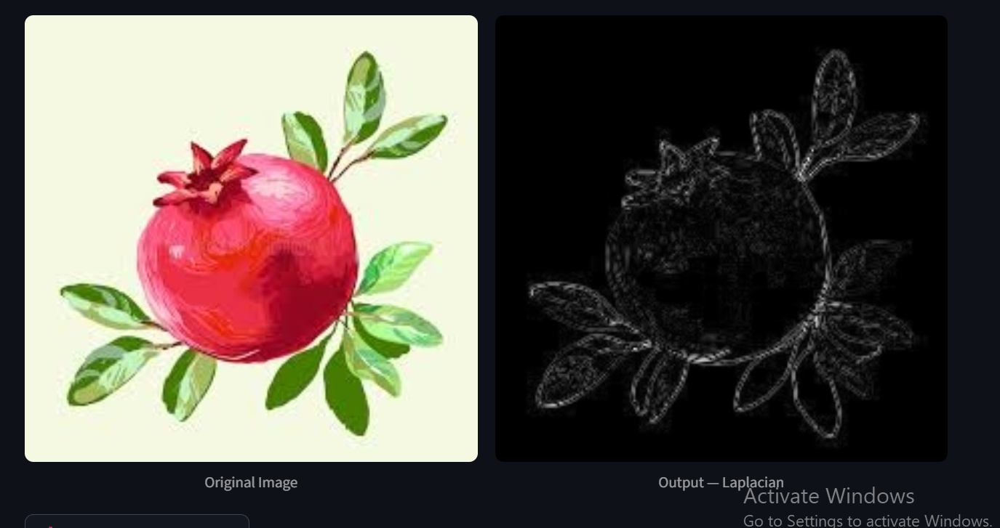
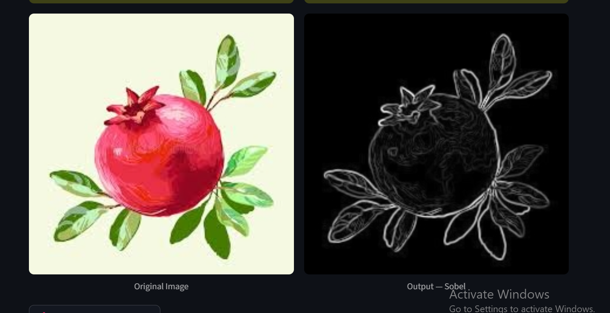
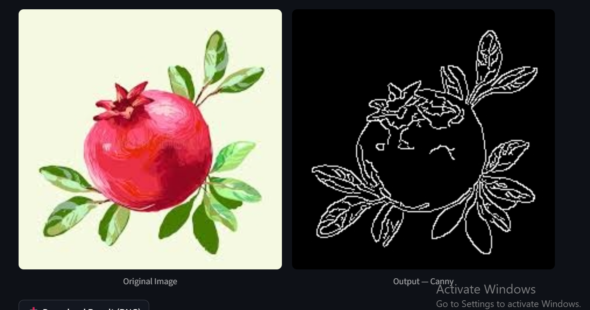

# Edge Detection Visualizer

An interactive **Computer Vision app** built using **Streamlit** and **OpenCV**, designed for visualizing and comparing different **edge detection algorithms**.

## Features
- Upload an image (JPG, PNG, BMP)
- Apply Canny, Sobel, or Laplacian filters
- Adjust parameters easily with sliders
- View input and output images side-by-side

## Tech Stack
- Python
- Streamlit
- OpenCV
- NumPy
- Pillow

## How to Run
1. Clone the repository:
   ```bash
   git clone https://github.com/MaryamGondal/Edge-detection-app-streamlit.git
   cd edge-detection-app

   ## 📸 Screenshots

### Interface Example


### Edge Detection Result



### Edge Detection Result



